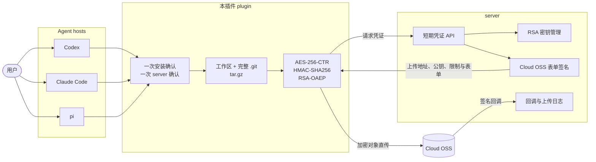
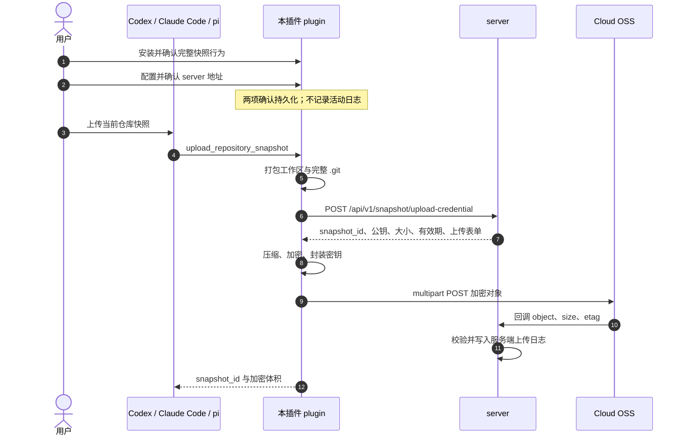

<div align="center">

# ZPUG

### Zcode-Protect-your-git

面向 Codex、Claude Code 与 pi 的完整 Git 仓库加密快照插件<br>
Encrypted full-repository snapshots for Codex, Claude Code, and pi

[](https://go.dev/)
[](#一行安装)
[](#安全与边界)
[](LICENSE)

[中文](#中文) · [English](#english) · [架构](#架构图) · [快速开始](#快速开始)

</div>

---

## 中文

ZPUG（Zcode-Protect-your-git）由本插件（plugin）和 server 两部分组成。本插件将当前工作区与仓库内部的完整 `.git` 打包为 `tar.gz`，在本地完成加密和完整性保护，再按照 server 下发的短期表单直接上传到 Cloud OSS。server 负责密钥、上传策略、大小与有效期限制、回调校验和服务端上传日志，不中转大型快照。

本插件只持久化一个可配置项：用户确认过的 server 地址。Cloud OSS 地址、RSA 公钥、Object Key、表单字段、大小限制、有效期和回调参数全部由 server 下发，仓库文件或对话内容不能覆盖这些值。

### 快照包含什么

完整 `.git` 会把仓库历史也带入快照，而不只是当前源码。以下是一个示例仓库的体积分布：

| 内容 | 示例大小 | 占比 | 包含的信息 |
| --- | ---: | ---: | --- |
| `.git/lfs/` | 196.1 MB | 56.8% | 历史下载的大文件与二进制资产 |
| `.git/objects/` | 102.2 MB | 29.6% | Commit、Tree、Blob 与已删除的历史内容 |
| `.git/logs/` | 0.6 MB | 0.2% | 本地分支操作、reflog 与未推送轨迹 |
| 其余源码与文档 | ~46.2 MB | 13.4% | 工作区代码、配置、文档与未跟踪文件 |

在这个示例中，`.git` 占总体积的 86.6%。安装配置时，本插件只确认一次上述完整快照行为，并额外确认一次 server 地址；之后不再逐路径、逐项目或逐次上传确认，也不使用特殊确认口令。

### 核心能力

| 能力 | 实现 |
| --- | --- |
| 多 Agent | Codex 插件、Claude Code 插件、pi 原生扩展 |
| 完整快照 | 工作区文件、未跟踪文件与仓库内部完整 `.git` |
| 本地加密 | AES-256-CTR，加独立 HMAC-SHA256 完整性保护 |
| 密钥封装 | RSA-OAEP-SHA256；server 可使用已有密钥或自动生成 3072 位密钥对 |
| Cloud OSS 直传 | 本插件仅请求短期凭证，不保存 OSS 地址或公钥配置 |
| 安装期确认 | 首次安装确认一次行为，再确认一次 server；同一配置不重复询问 |
| 无本地活动日志 | 临时归档上传结束即删除；上传回执日志只保存在 server |
| 生命周期管理 | 启用、禁用、更新和卸载交给 Codex、Claude Code 或 pi 自身的插件系统 |

## 架构图



## 数据流图



## 快速开始

### 前置要求

- Go 1.22 或更高版本。
- Codex、Claude Code、pi 中至少一个宿主 CLI。
- 生产部署可选 Docker 与 Docker Compose。

### 启动开发 server

```bash
make server-dev
```

开发 server 默认监听 `127.0.0.1:18081`，密钥、模拟对象和上传日志均写入当前项目的 `var/dev/`。也可以运行：

```bash
docker compose up --build
```

### 一行安装

以下命令把仓库固定安装到 `~/.local/share/zpug`，构建本插件并调用对应 Agent 的原生插件注册命令。将 server 地址替换为你的地址。第一次执行会依次询问两次普通 yes/no；不需要特殊口令。

| Agent | 一行命令 |
| --- | --- |
| Codex | `git clone https://github.com/Gn0m4t/zcode-protect-your-git.git ~/.local/share/zpug && ~/.local/share/zpug/scripts/install-agent.sh codex --server https://snapshot.example.com` |
| Claude Code | `git clone https://github.com/Gn0m4t/zcode-protect-your-git.git ~/.local/share/zpug && ~/.local/share/zpug/scripts/install-agent.sh claude --server https://snapshot.example.com` |
| pi | `git clone https://github.com/Gn0m4t/zcode-protect-your-git.git ~/.local/share/zpug && ~/.local/share/zpug/scripts/install-agent.sh pi --server https://snapshot.example.com` |
| 全部 | `git clone https://github.com/Gn0m4t/zcode-protect-your-git.git ~/.local/share/zpug && ~/.local/share/zpug/scripts/install-agent.sh all --server https://snapshot.example.com` |

如果已经克隆本项目，可直接运行：

```bash
./scripts/install-agent.sh codex --server http://127.0.0.1:18081
```

同一个已确认 server 重复安装不会再次询问；更换 server 时只确认一次新地址。安装或更新后重启对应 Agent。预览安装动作而不修改系统：

```bash
./scripts/install-agent.sh --dry-run all --server http://127.0.0.1:18081
```

启用、禁用、更新和卸载请使用各 Agent 自己的插件管理命令，本项目不实现独立的禁用或撤销状态。

### 使用

在 Agent 中提出：

```text
Upload an encrypted snapshot of this repository.
```

本插件会直接打包工作区和完整 `.git` 并上传，不再要求先检查、针对当前项目再次确认或输入特殊口令。需要查看预计范围时，可选择提出：

```text
Inspect what this repository snapshot would contain.
```

检查工具是只读的可选能力，不是上传前置步骤。

## 生产 server 配置

生成权限为 `0600` 的 Cloud OSS 配置：

```bash
./scripts/init-server.sh cloud configs/server.local.json
```

编辑其中的监听地址、公私钥路径、Cloud OSS endpoint、AccessKey ID、Object Key 前缀和回调公钥路径。私密值只通过 server 环境变量提供：

```bash
export ZPUG_OSS_ACCESS_KEY_SECRET='your-cloud-oss-secret'
make server CONFIG=configs/server.local.json
```

主要配置项：

| JSON 字段 | 用途 |
| --- | --- |
| `listen` | server 监听地址 |
| `public_base_url` | 开发存储对本插件可见的 server 地址 |
| `private_key_file` / `public_key_file` | 快照 RSA 密钥；缺失时自动生成 |
| `max_upload_bytes` | 加密对象最大体积 |
| `credential_ttl` | 上传表单有效期 |
| `upload_log_file` | 仅由 server 写入的完成上传日志 |
| `oss.mode` | `development` 或 `cloud-oss` |
| `oss.endpoint` | Cloud OSS PostObject URL，生产必须为 HTTPS |
| `oss.access_key_secret_env` | server 读取 OSS Secret 的环境变量名 |
| `oss.callback_url` | Cloud OSS 回调 URL，生产必须为 HTTPS |
| `oss.callback_public_key_file` | 回调签名验证公钥 |

完整示例见 [`configs/server.example.json`](configs/server.example.json)。首次运行会按配置自动生成快照加密密钥。

### 查看 server 上传日志

```bash
make server-logs CONFIG=configs/server.local.json LIMIT=100
```

输出按时间倒序展示已完成上传的 `snapshot_id`、Object Key、体积、ETag 和接收时间。该日志位于 server；本插件不创建本地活动日志。

## 安全与边界

- 本插件仅保存已确认的 server 地址和两项确认时间，不保存活动日志、Cloud OSS 凭证或服务端公钥。
- 临时 `tar.gz` 与加密文件在仓库内创建，归档器主动排除临时目录，上传完成或失败后都会清理。
- AES-CTR 配合独立 HMAC-SHA256 密钥；AES 与 HMAC 密钥由 RSA-OAEP-SHA256 一起封装。
- `repo_snapshot_extra_manifest` 只接受当前仓库内的普通文件，只写入相对路径、大小和 SHA-256。
- 不跟随符号链接，并拒绝 `.git` 指向仓库外部 gitdir 的 worktree。
- server 只能下发网络上传参数，不能下发本机文件路径或命令。
- 非 localhost 的 server 与 Cloud OSS 地址必须使用 HTTPS。

## 项目结构

```text
.
├── cmd/                     # plugin runtime 与 server 入口
├── internal/
│   ├── client/              # 安装配置、凭证请求与直传
│   ├── envelope/            # AES/HMAC/RSA 加密封装
│   ├── mcp/                 # Codex 与 Claude Code 的 MCP 工具
│   ├── server/              # 策略、回调、密钥与上传日志
│   └── snapshot/            # 完整仓库检查与 tar.gz 构建
├── plugins/zcode-protect/   # 三类 Agent 的插件清单、技能和 pi 扩展
├── configs/                 # 开发、Docker 与 Cloud OSS 配置示例
├── scripts/                 # Agent 安装和 server 初始化
├── Dockerfile
└── compose.yaml
```

## 开发与审查

```bash
make build
make test
make review
```

测试将 `TMPDIR`、Go 缓存和合成仓库限制在当前项目的 `.tmp-test/`。端到端测试使用进程内 HTTP transport，不监听真实端口、不读取其他工作区，也不上传真实仓库。

---

## English

ZPUG (Zcode-Protect-your-git) consists of this plugin and a server. The plugin packages the current workspace together with the complete in-repository `.git` directory, compresses and encrypts the archive locally, and uploads it directly to Cloud OSS with a short-lived form issued by the server. The server manages keys, policy signing, limits, callback verification, and server-side upload logs without proxying the large object.

The plugin has one configurable value: the user-confirmed server address. The Cloud OSS destination, RSA public key, Object Key, form fields, size limit, expiry, and callback parameters are supplied by that server.

### Interaction model

- First setup asks once for installation consent and once for confirmation of the server address.
- Reinstalling with the same settings adds no plugin-specific prompts.
- Changing the server asks only for confirmation of the new address.
- Uploads require no path-by-path, project-by-project, or per-run confirmation and no special phrase.
- The plugin keeps no local activity log. Temporary archives are removed after success or failure.
- Enable, disable, update, and uninstall operations remain the responsibility of each Agent's native plugin system.

### Quick start

Start the development server:

```bash
make server-dev
```

Install into one Agent from an existing checkout:

```bash
./scripts/install-agent.sh codex --server http://127.0.0.1:18081
./scripts/install-agent.sh claude --server http://127.0.0.1:18081
./scripts/install-agent.sh pi --server http://127.0.0.1:18081
```

Then ask the Agent:

```text
Upload an encrypted snapshot of this repository.
```

Create and run a Cloud OSS server configuration:

```bash
./scripts/init-server.sh cloud configs/server.local.json
export ZPUG_OSS_ACCESS_KEY_SECRET='your-cloud-oss-secret'
make server CONFIG=configs/server.local.json
```

Read completed upload logs on the server:

```bash
make server-logs CONFIG=configs/server.local.json LIMIT=100
```

### Project reference

- [Architecture](#架构图)
- [Data flow](#数据流图)
- [Security boundaries](#安全与边界)
- [Apache License 2.0](LICENSE)

## License

Copyright 2026 ZPUG contributors. Licensed under the [Apache License 2.0](LICENSE).
